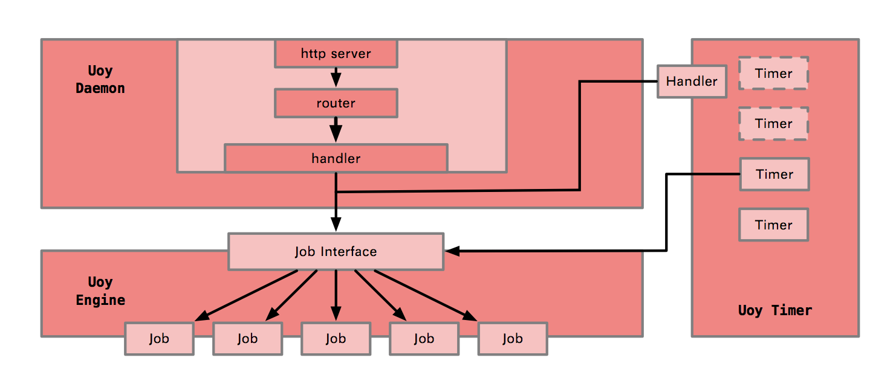

# uoy 进程任务管理工具

## 前言
提供一个用于管理任务执行的工具，用于监控任务进度以及日志等信息。

## 设计结构

共三个模块：`Daemon`,`Engine`,`Timer`

- Daemon 负责接收并处理请求
- Engine 负责任务的执行与进程的监控
- Timer 负责定时任务的调度

## 对外接口

### 任务系列

| 功能   |      接口      |
|----------|:-------------:|
| 添加任务 |  /v1/job/add |
| 查看任务 |  /v1/job/info |
| 删除任务 |  /v1/job/delete |

### 定时事件系列

| 功能   |      接口      |
|----------|:-------------:|
| 添加定时事件 |  /v1/timer/add |
| 查看定时事件 |  /v1/timer/info |
| 删除定时事件 |  /v1/timer/delete |

## 版权许可

请查看 [LICENSE](LICENSE) 文件.